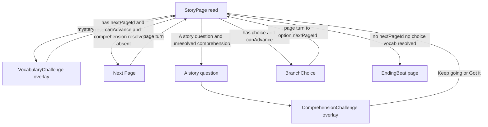
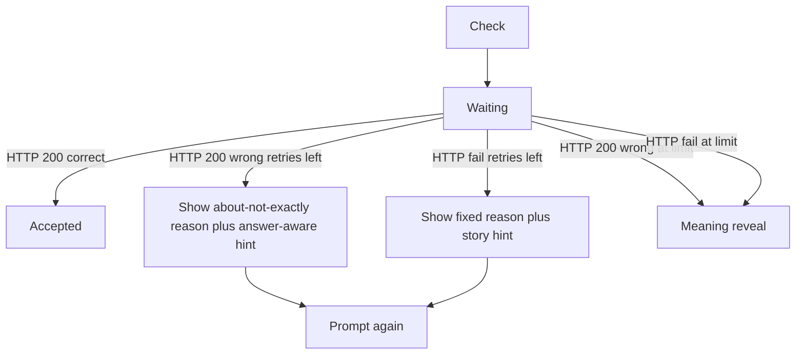
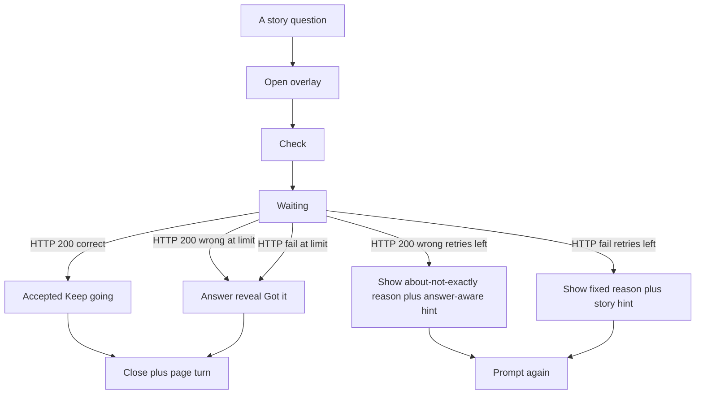
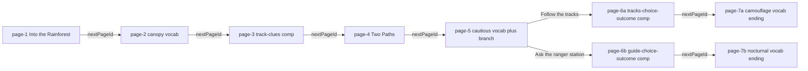

# Story navigation

Implementation notes for the reader (page ids, overlays, flip-book spine). Product “why” is in [learning-design.md](learning-design.md). Grading is in [grading.md](grading.md).

The story reader advances by **page id**, not array order. Each page in [`src/lib/story/story-data.ts`](../src/lib/story/story-data.ts) either:

- has `nextPageId` — linear **Next Page**
- has `choice` — two equal-weight options (`BranchChoice`)
- has neither — ending (swaps to the **EndingBeat** page when vocab on the page is resolved)

Optional interactions on a page:

- **Vocabulary:** mystery word segments; hide **Next Page** / branch until every mystery word on the page is resolved (the highlighted word is the next-action cue — do not silently disable a grey Next Page)
- **Comprehension:** `comprehensionId`; footer primary reads **A story question** until resolved; the first press opens the challenge overlay instead of turning the page

State lives in [`StoryReader`](../src/components/story/StoryReader.tsx) (`pageId` → `storyPagesById`). Page turns (Next Page, Previous Page, and branch picks) use [`react-pageflip`](../src/components/story/StoryFlipBook.tsx) on a **session spine** of sheets: optional previous (visit history), current page, and an optional **peek** next page. Peek exists only when a linear forward turn is allowed (`peekNextPageIdFor` in [`page-helpers.ts`](../src/lib/story/page-helpers.ts)) — no peek while vocab-gated, comprehension unresolved, on a branch page, or on a last page. Turns are **button-driven only** (no corner-drag / click-to-flip). Cover entrance and EndingBeat stay outside the flip book.

## Cover screen

On first load, [`StoryReader`](../src/components/story/StoryReader.tsx) shows [`StoryCoverView`](../src/components/story/StoryCoverView.tsx) before page 1:

- **Cover art** and story title from `STORY_META` in [`story-data.ts`](../src/lib/story/story-data.ts)
- **Mystery words** teaser — “Find mystery words along the way”
- **Quick tips** — two micro-steps (tap a glowing word and type what you think it means; make choices for Mia)
- **Start Reading** — triggers a one-shot dolly-in zoom (cover scales toward the viewer, crossfades into page 1); orchestrated by [`StoryCoverEntrance`](../src/components/story/StoryCoverView.tsx)

Session flag `hasStarted` flips to `true` only after the entrance animation completes. **Read the chapter again** from the ending beat resets chapter progress but keeps `hasStarted: true`, so replay skips the cover and entrance animation.

## Page flow

## Ending beat (`EndingBeat`)

When the child resolves the last vocab word on `page-7a` or `page-7b` and closes the vocab overlay, [`StoryReader`](../src/components/story/StoryReader.tsx) **replaces** the story page with [`EndingBeat`](../src/components/story/EndingBeat.tsx) — a full storybook page (same atmosphere / book-card shell), not a modal over the last page:

1. **Book coloring** — SVG fill animation (~1.4s; skipped when reduced motion)
2. **Celebration** (one screen) — **Story complete!** + “You found one/both endings”, count-up + learned-word list (correct vocab only), **Story paths** tracker, and the CTA: if one ending is still unseen, primary **Discover Another Ending** (`jumpToBranch`: clears path-specific progress, keeps shared progress / words learned / `exploredEndingIds`) with ghost **Read the chapter again**. If both endings are already explored: primary **Read the chapter again** (full chapter reset, keeps `hasStarted` so replay skips the cover). No chapter-2 stub.

Words-learned on the ending screen counts only vocab answers graded **correct** (not meaning reveals). Comprehension corrects never appear in the word list.

## Vocab challenge client flow (`StoryReader`)

Server path (not shown in the client diagram): live AI grade via `POST /api/grade-vocabulary` (`openai/gpt-oss-120b`, Gateway failover to `google/gemini-3.1-flash-lite`) → on live failure, **local keyword** `GradeResult` (still HTTP 200).

- **Correct (HTTP 200):** words-learned increments; overlay closes after “Keep reading”. Grade may be from live AI or the local keyword matcher.
- **Wrong (HTTP 200):** kid-facing miss UI shows chrome + soft about/not-exactly `reason` + answer-aware `hint`; attempt burned; at `MAX_ATTEMPTS` → meaning reveal.
- **HTTP / transport failure:** burn attempt; fixed short reason **“Not quite — try another way.”** + next story `hints` tier; at `MAX_ATTEMPTS` → meaning reveal. Same path for a **client timeout** after a few seconds (the in-flight fetch is aborted).

## Comprehension challenge client flow (`StoryReader`)

Trigger: **A story question** on a page with unresolved `comprehensionId` (never auto-open on page enter).

Server path: live AI grade via `POST /api/grade-comprehension` (`openai/gpt-oss-120b`, Gateway failover to `google/gemini-3.1-flash-lite`) → on live failure, **local keyword** `GradeResult` (still HTTP 200).

- **Correct (HTTP 200):** short why (`reason`); **no** words-learned bump; “Keep going” closes overlay and advances to `nextPageId`.
- **Wrong (HTTP 200):** same soft miss chrome as vocab; attempt burned; at `MAX_ATTEMPTS` → answer reveal.
- **HTTP / transport failure:** burn attempt; fixed reason + story `hints` tier; at limit → answer reveal. Same path for a client timeout after a few seconds.
- Closing with X before resolve does not advance; **A story question** can reopen the challenge.

## Mia and the Hidden Sloth (7-page graph)

