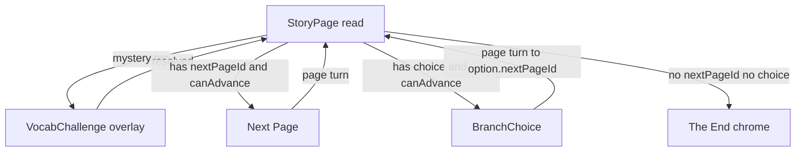
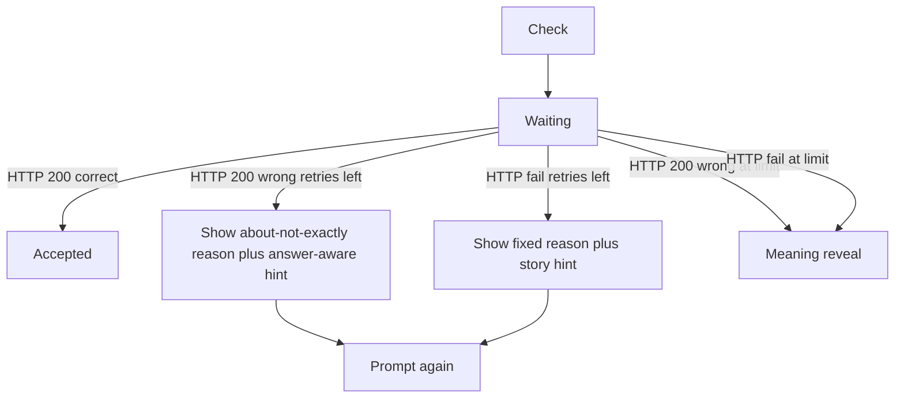
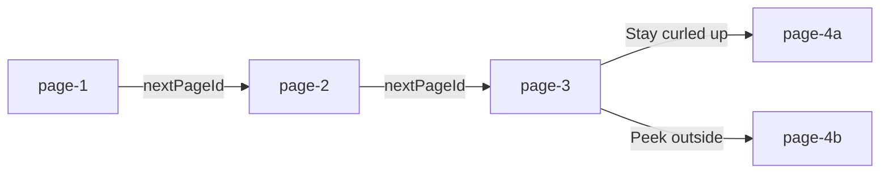

# Story navigation

The story reader advances by **page id**, not array order. Each page in [`src/lib/story-data.ts`](../src/lib/story-data.ts) either:

- has `nextPageId` — linear **Next Page**
- has `choice` — two equal-weight options (`BranchChoice`)
- has neither — ending (“The End of this adventure!”)

Progression stays gated until every mystery word on the current page is resolved (accepted explanation or meaning reveal). Vocab challenges open as an overlay over the same page; they never advance the story themselves.

State lives in [`StoryReader`](../src/components/story/StoryReader.tsx) (`pageId` → `storyPagesById`). Page turns (Next Page and branch picks) use the shared CSS exit → advance → enter animation in [`StoryPageView`](../src/components/story/StoryPageView.tsx).

## Page flow

## Challenge client flow (`StoryReader`)

Server path (not shown in the client diagram): live AI grade with Gateway failover → on live failure, **local keyword** `GradeResult` (still HTTP 200).

- **Correct (HTTP 200):** words-learned increments; overlay closes after “Keep reading”. Grade may be from live AI or the local keyword matcher.
- **Wrong (HTTP 200):** kid-facing miss UI shows chrome + soft about/not-exactly `reason` + answer-aware `hint`; attempt burned; at `MAX_ATTEMPTS` → meaning reveal.
- **HTTP / transport failure:** burn attempt; fixed short reason **“Not quite — try another way.”** + next story `hints` tier; at `MAX_ATTEMPTS` → meaning reveal.

## Pip and the Rainy Woods (current graph)

