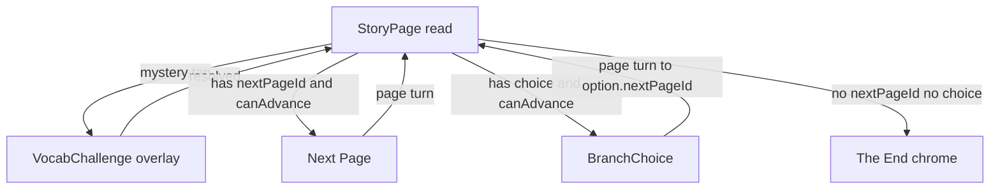
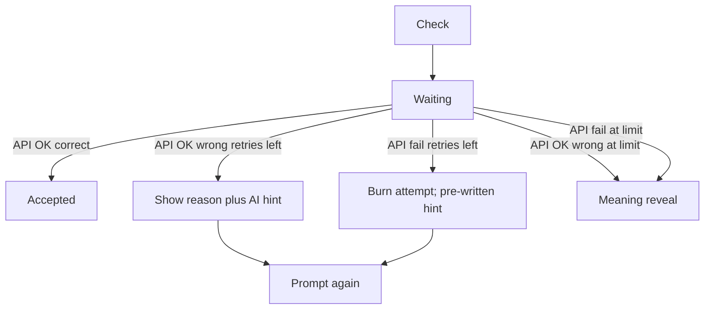
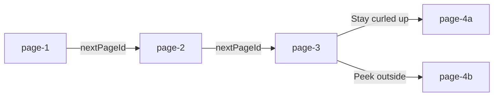

# Story navigation

The story reader advances by **page id**, not array order. Each page in [`src/lib/story-data.ts`](../src/lib/story-data.ts) either:

- has `nextPageId` — linear **Next Page**
- has `choice` — two equal-weight options (`BranchChoice`)
- has neither — ending (“The End of this adventure!”)

Progression stays gated until every mystery word on the current page is resolved (accepted explanation or meaning reveal). Vocab challenges open as an overlay over the same page; they never advance the story themselves.

State lives in [`StoryReader`](../src/components/story/StoryReader.tsx) (`pageId` → `storyPagesById`). Page turns (Next Page and branch picks) use the shared CSS exit → advance → enter animation in [`StoryPageView`](../src/components/story/StoryPageView.tsx).

## Page flow

## Challenge client flow (`StoryReader`)

- **Correct:** words-learned increments; overlay closes after “Keep reading”.
- **Wrong (API OK):** live `reason` + live `hint` from the grade response; attempt burned; at `MAX_ATTEMPTS` → meaning reveal.
- **API failure:** burn attempt; short unavailable reason + next pre-written `hints` tier; at `MAX_ATTEMPTS` → meaning reveal (child is never stuck if grading is down).

## Pip and the Rainy Woods (current graph)

