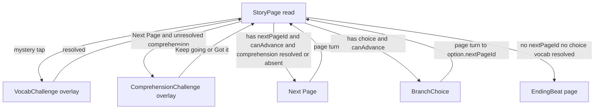
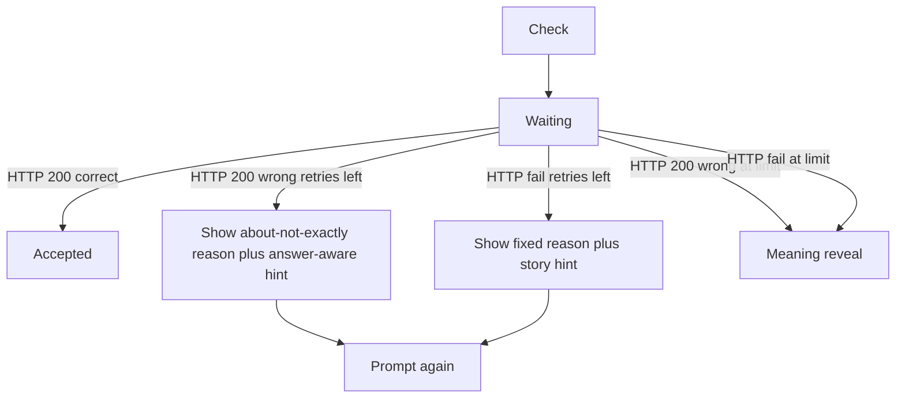
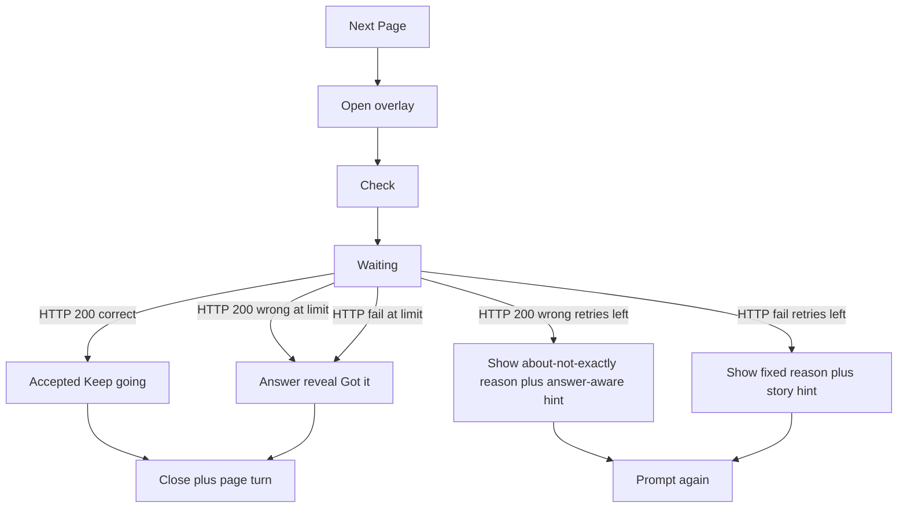
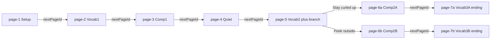

# Story navigation

The story reader advances by **page id**, not array order. Each page in [`src/lib/story-data.ts`](../src/lib/story-data.ts) either:

- has `nextPageId` — linear **Next Page**
- has `choice` — two equal-weight options (`BranchChoice`)
- has neither — ending (swaps to the **EndingBeat** page when vocab on the page is resolved)

Optional interactions on a page:

- **Vocabulary:** mystery word segments; Next Page / branch stay gated until every mystery word on the page is resolved
- **Comprehension:** `comprehensionId`; Next Page stays enabled, but the first press opens the challenge overlay instead of turning the page

State lives in [`StoryReader`](../src/components/story/StoryReader.tsx) (`pageId` → `storyPagesById`). Page turns (Next Page and branch picks) use the shared CSS exit → advance → enter animation in [`StoryPageView`](../src/components/story/StoryPageView.tsx).

## Page flow

## Ending beat (`EndingBeat`)

When the child resolves the last vocab word on `page-7a` or `page-7b` and closes the vocab overlay, [`StoryReader`](../src/components/story/StoryReader.tsx) **replaces** the story page with [`EndingBeat`](../src/components/story/EndingBeat.tsx) — a full storybook page (same atmosphere / book-card shell), not a modal over the last page:

1. **Book coloring** — SVG fill animation (~1.4s)
2. **Celebration** (one screen) — “Story complete!” + count-up + learned-word list + “You explored N of 2 endings”, then “Next chapter unlocked!” + replay nudge + two CTAs:
   - **Read chapter 2** (primary) → chapter-2 unlock stub (not playable content)
   - **Read the chapter again** (secondary) → resets chapter 1; keeps `exploredEndingIds` in session

Words-learned on the ending screen counts only vocab answers graded **correct** (not meaning reveals). Comprehension corrects never appear in the word list.

## Vocab challenge client flow (`StoryReader`)

Server path (not shown in the client diagram): live AI grade via `POST /api/grade-vocabulary` (`openai/gpt-oss-120b`, Gateway failover to `google/gemini-2.5-flash-lite`) → on live failure, **local keyword** `GradeResult` (still HTTP 200).

- **Correct (HTTP 200):** words-learned increments; overlay closes after “Keep reading”. Grade may be from live AI or the local keyword matcher.
- **Wrong (HTTP 200):** kid-facing miss UI shows chrome + soft about/not-exactly `reason` + answer-aware `hint`; attempt burned; at `MAX_ATTEMPTS` → meaning reveal.
- **HTTP / transport failure:** burn attempt; fixed short reason **“Not quite — try another way.”** + next story `hints` tier; at `MAX_ATTEMPTS` → meaning reveal.

## Comprehension challenge client flow (`StoryReader`)

Trigger: **Next Page** on a page with unresolved `comprehensionId` (never auto-open on page enter).

Server path: live AI grade via `POST /api/grade-comprehension` (`openai/gpt-oss-120b`, Gateway failover to `google/gemini-2.5-flash-lite`) → on live failure, **local keyword** `GradeResult` (still HTTP 200).

- **Correct (HTTP 200):** short why (`reason`); **no** words-learned bump; “Keep going” closes overlay and advances to `nextPageId`.
- **Wrong (HTTP 200):** same soft miss chrome as vocab; attempt burned; at `MAX_ATTEMPTS` → answer reveal.
- **HTTP / transport failure:** burn attempt; fixed reason + story `hints` tier; at limit → answer reveal.
- Closing with X before resolve does not advance; Next Page can reopen the challenge.

## Pip and the Rainy Woods (7-page graph)

